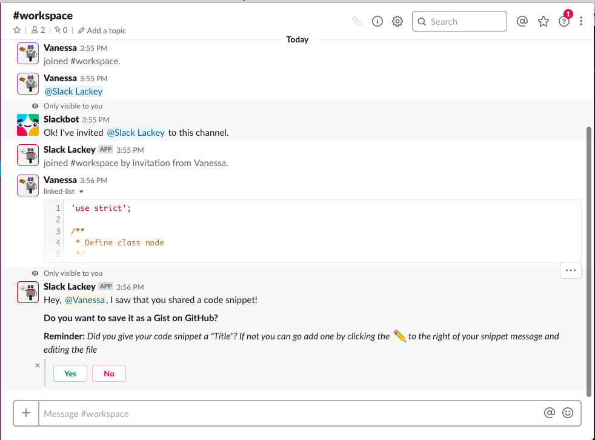
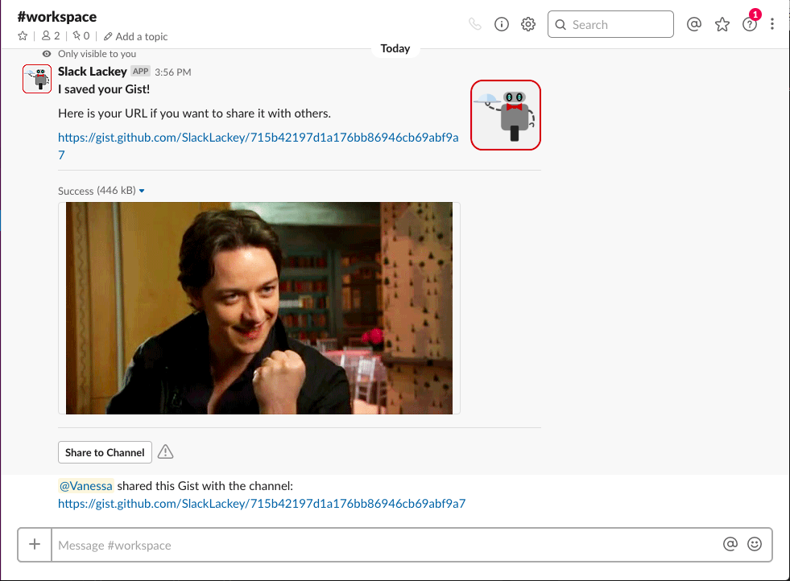
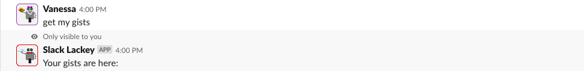
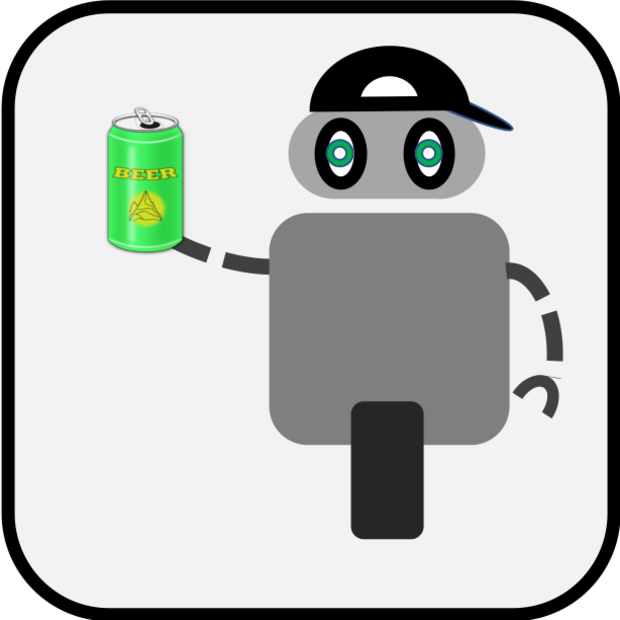
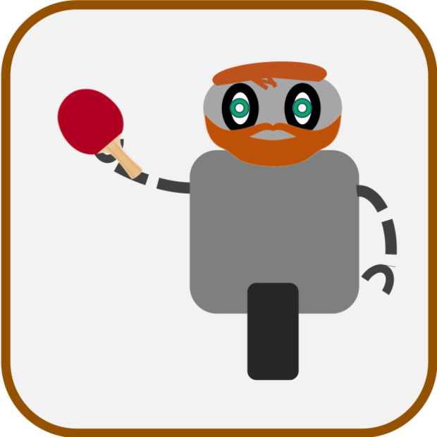

<h1 align="center"> SLACK-LACKEY </h1>  

  

  Code saving and sharing. Built with Nodejs.

  

## Table of Contents

- [Links and resources](#links-and-resources)
- [Introduction](#introduction)
- [Tools](#tools)
- [Features](#features)
- [Set up](#Set-up)
- [How to use](#How-tou-se)
- [UML](#uml)
- [Documentations](#Documentations)
- [Contributors](#contributors)
- [Feedback](#feedback)

## Links and resources

* [Aws](https://github.com/slack-lackey/docs/wiki)
* [Heroku](https://slack-bot-api-server.herokuapp.com)

## Introduction

A tool for saving and sharing code to gist inside of slack channel. If you're looking for a way to save a code snippet in Slack, Slack-lackey is the best app for it.

## Tools

## Features

A few of the things you can do with Slack-lackey:

* Save code snippet to your gist
* Save code block to yous gist
* Save edited code to your gist
* Share your gist link into the channel
* Get all the gists you save

  

  

  

## Set up

#### Environment requirements

- Clone or download the [Bot-server repo](https://github.com/slack-lackey/bot-server)
- `npm install` to install dependencies
- Create a new app to your workspace follow the instruction of [Creating slack app](https://github.com/slack-lackey/bot-server/blob/development/README.md)
- new a .env file, set all the keys needed for the app

**Keys are required for building your own bot. **

#### Running the App
- `nodemon` or `npm start` to start the app

## How to use

In your workspace:
- When receive or send a code block or snippet, click yes if you want to save it; click no if you don't.
- When successfully saved to gist, click yes if you want to share to the channel; click no if you don't.
- If you want to get all the gists that previously saved, input `get my gists`.

## UML
* 

## Documentations

* [Project wiki](https://github.com/slack-lackey/docs/wiki)
* [Group agreement]()
* [User stories]()

## Contributors

This project is brought to you by these awesome contributors.

## Feedback

Feel free to send us feedback on [file an issue](https://github.com/slack-lackey/docs/issues/new). Feature requests are always welcome. 

